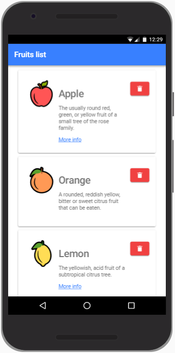
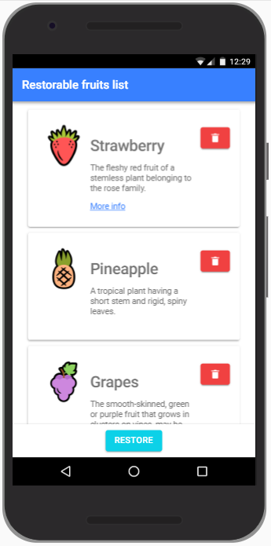
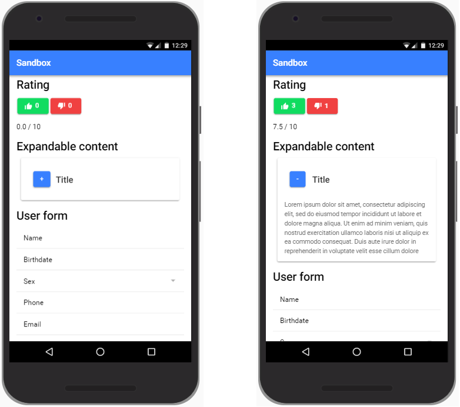

# Día 3

## Conceptos

- Instalar Ionic y Cordova: `npm install -g @ionic/cli cordova`
- Proyecto base de Ionic / Proyecto base de Angular
- Patrón modelo-vista-controlador
- Typescript
- Componentes. Desarrollo orientado a componentes.
- Documentación de Ionic: Quick start, componentes visuales y API

## Estructura de un proyecto Ionic 5

- Crear un proyecto base con:

```Shell
ionic start explanation-app blank --no-git
```

- Configurar el entorno de desarrollo (general, no concreto del proyecto actual) para que en Typescript, HTML y SCSS las tabulaciones sean de 2 espacios.
- Es un proyecto NodeJS (pakage.json, node_modules)
- Es un proyecto Webpack (transpila el código fuente de _src/_ en _www/_)
- Es un proyecto Angular
- Es un proyecto Cordova (desde que se añade alguna plataforma).
- Evitar algunos de los warnings de la consola añadiendo al app.component.ts:

```Typescript
if(platform.is('cordova')) {
```

## Typescript

- Abrir _src/app/home/home.page.ts_
- Tipos básicos: _boolean_, _number_, _string_, _array_, _enum_, _any_, _null_
- Interfaces: definición de contratos de clases, pero también usadas para definir modelos de datos
- Clases: atributos y métodos, getters y setters herencia, implementación de interfaces, modificadores de acceso, palabra clave this
- Estructura de un proyecto Angular
- Punto de entrada de la aplicación _main.ts_
- Módulo principal de la aplicación _AppModule_
- Componente principal de la aplicación _AppComponent_ (controlador y vista)
- Módulo de definición de rutas de la aplicación _AppRoutingModule_
- Módulo de la página home de la aplicación _HomePageModule_ y su componente _HomePage_ (controlador y vista).
- Carpeta _assets_
- Carpeta _environment_
- Themes
- _angular.json_

## Ejemplo de aplicación de lista de frutas



### Explicación 1

- Copiar los datos de las frutas contenidos en mocks al controlador principal y elaborar una maquetación “estática” usando _ion-header_, _ion-content_, _ion-card_...

### Explicación 2

- Ciclo de vida de un componente: _ngOnInit_ y _ngOnDestroy_.
- Crear una variable para almacenar cada una de las propiedades de la manzana, inicializarlas en _ngOnInit_ y parametrizar en el HTML cada uno de los atributos.
- Data binding usando _{{ expr }}_ en los contenidos, _attr=”{{ expr }}”_ en los atributos y también _[attr]=”expr”_
- Crear una variable para almacenar un array de frutas, inicializarla en _ngOnInit_ y parametrizar en el HTML cada uno de los atributos. En el IDE se puede contraer el array con el fin de hacer el código más legible.

### Explicación 3

- Directiva _\*ngFor_
- Preparar el HTML para que itere y muestre las frutas usando la directiva _\*ngFor_
- Directivas _\*ngIf_ y _[hidden]_ y sus diferencias
- Diferencia entre directivas estructurales y “básicas”
- Eliminar el link de algunas de las frutas y mostrarlo sólo en aquellas que lo tengan disponible.
- Gestionar el evento click sobre los botones de eliminar fruta. Cuando se pulse sobre alguno de ellos, se debe mostrar por consola el índice de la fruta que corresponda.

## Ejercicio 1

Amplíe la aplicación de explicación anterior con la funcionalidad que se indica a continuación:



1. Dote a los botones de eliminar de funcionalidad: cuando se pulse, se eliminará la fruta correspondiente del array y, consecuentemente, este cambio se reflejaría en la vista.

2. Incluya también un footer fijo con un botón de restaurar. Si todas las frutas están disponibles en la lista (no se ha eliminado ninguna), este botón estaría deshabilitado. En caso contrario, el botón estaría habilitado y al pulsarlo se restauraría la lista de frutas original.

## Ejercicio 2

Practique con el uso de componentes de Ionic creando la siguiente pantalla:



1. La sección Rating debe disponer de 2 botones: el verde representa un like; el rojo un dislike. Cada vez que se pulse, se incrementará el contador que incluye. También se actualizaría la media de votos que se indica abajo. Si no se ha realizado ninguna votación, se indicará 0; si no, se indicará la media aritmética de los votos, considerando que like cuanta como 10 y dislike como 0.

2. La sección Expandable content debe contener un panel que muestre u oculte un determinado contenido al pulsar sobre el botón de su cabecera. Este botón tendrá el símbolo + si está contraído; el símbolo - si está expandido.

3. La sección User form contendrá un formulario con los siguientes campos: nombre de tipo texto, fecha de nacimiento de tipo fecha, sexo de tipo desplegable (con valores masculino y femenino), teléfono de tipo número y email de tipo email.

4. Añadir un footer fijo con un botón como el del listado de frutas pero que no ocupe todo el ancho de la pantalla (como se ve en la fotografía de la pantalla de frutas). Este botón reseteará las puntuaciones a cero, la media de votos a cero y cerrará el contenido expandible.

5. En la pantalla Home, añadir un botón que navegue a la sección Rating.
