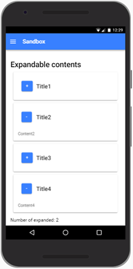
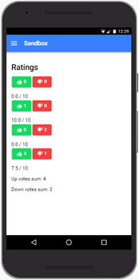
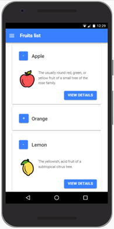
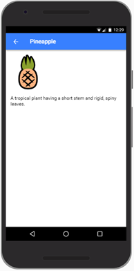

# Día 4

## Conceptos

- Componentes
- Módulos
- Servicios
- Enrutamiento y navegación entre páginas

## Explicación de componentes

- Partir de la aplicación de la solución a los ejercicios propuestos del día anterior.

- Mover la página de lista de frutas a una carpeta _pages_.

- Crear un componente _fruit-card_ que representa una tarjeta de fruta:

```Shell
ionic generate component components/fruit-card
```

- Crear un módulo desde el cual se exportará el componente (si se declarasen más componentes, también se exportarían desde aquí):

```Shell
ionic generate module components
```

- En dicho módulo se debe declarar _FruitCardComponent_; debe importar _CommonModule_ e _IonicModule_; y debe exportar _FruitCardComponent_.

- Este módulo de componentes se debe importar en el módulo de la página de la lista de frutas, porque en ella se usará _FruitCardComponent_.

- Probar que el componente funciona correctamente (basta con que contenga un texto estático y se visualice en una página).

- El componente tendrá un parámetro de entrada _fruit_ que representa la fruta.

- También tendrá un evento de salida _deletePressed_ que se emitirá cuando se pulse sobre el botón eliminar.

## Explicación de servicios, enrutamiento y navegación entre páginas

- Crear un proyecto base con:

```Shell
ionic start explanation-app-2 sidemenu --no-git
```

- Dar un vistazo general al Proyecto: cómo funciona una aplicación con un sidemenu, cómo se enrutan otras vistas, etc.

- Mover la carpeta de la página _folder_ dentro de una carpeta _pages_ (en el código sólo implicaría un cambio en el _app-routing.module.ts_).

- En _app.component.ts_, mover el código del constructor a _ngOnInit_.

- Crear un servicio _LabelService_ donde residirá la lógica de gestión de la lista de etiquetas que aparece en el menú:

```Shell
ionic generate service services/labels
```

- En vez de usar el decorador _Injectable_ para que nos los provea en el módulo raiz, lo proveeremos nosotros explícitamente.

- Crear en el servicio _LabelService_ un método _getLabels_ que devuelva la lista de labels que está en _app.component.ts_.

- En el _ngOnInit_ de _app.component.ts_, obtener las labels a partir del método _getLabels_ de _LabelsService_.

- Crear en el menú una lista más que contendrá un único elemento _Help_, que usaremos para redirigir a una página de ayuda.

- Crear una nueva página _EmailsList_ con:

```Shell
ionic generate page pages/emails-list
```

- Explicar cómo funciona el módulo de routing de una página y que podría evitarse incluyendo la lógica de enrutado dentro del propio módulo de la página.

- La idea es que la ruta de Inbox abra la página de _EmailsList_ que estaría enrutada como _emails/:folder-id_. Hasta el momento es muy similar que la página folder. De hecho, su controlador, por el momento, es igual cambiando el parámetro.

- Preparamos el HTML para mostrar una lista con los títulos de diferentes emails.

- Crear un modelo/interfaz que representará un email. Tendrá un id, un title y un body.

- Crear un servicio que contendrá dos métodos: _getEmails(): Email[]_ y _getEmail(id: number): Email_.

- Obtener la lista de emails a través del servicio.

- Crear una página _EmailDetails_, que se enrutará como _emails/:folder-id/:email-id_.

- Preparar en la cabecera un botón de atrás para que se pueda navegar a la página anterior.

- La navegación en los templates (enlaces) se hace con la directiva _routerLink_, que se puede usar conjuntamente con la directiva _routerDirection_ para indicar la dirección de la navegación: _root_ para hacer que la vista sea la raiz de la pila de navegación, _forward_ para apilar (se podría volver a la pantalla anterior). Si no se especifica _routerDirection_, por defecto será forward.

- Con lo que conocemos ahora, resulta más fácil ver como funcionan los eventos del ciclo de vida de un componente: _ngOnInit_ y _ngOnDestroy_. Implementadlos en la página _EmailDetails_ incluyendo un _console.log_.

- Las páginas de Ionic usan _ion_router_outlet_. Este ofrece dos métodos muy útiles del ciclo de vida de las páginas, _ionViewDidEnter_ y _ionViewDidLeave_, que indican cuando se entra y se sale de ellas. Implementadlos en la página _EmailDetails_ incluyendo un _console.log_ y observad el orden en que se ejecutan todos.

## Ejercicio 1

Crear una nueva aplicación con la base de _sidemenu_. Crear una página Sandbox que contendrá un ejemplo de uso de los componentes _expandable-content_ y _rating_.

1. Crear el componente _expandable-content_ a partir de la maquetación elaborada el día anterior. La página Sandbox tendrá en su cabecera un botón para mostrar el menú principal. Tendría la siguiente apariencia:



La manera en la que se invoca el componente sería:

```HTML
<app-expandable-content title="Title1">Content1</app-expandable-content>

<app-expandable-content title="Title2">Content2</app-expandable-content>

<app-expandable-content title="Title3">Content3</app-expandable-content>
...
```

Pista: Pasar datos de entrada al componente como contenido de su tag se llama _transclusión_.

2. Dote al componente de la lógica necesaria para que se indique si el contenido está expandido o no. Use esta información para incluir en la página Sandbox el número de contenidos expandibles que están expandidos.

Pista:

```HTML
<app-expandable-content title="Title1" (change)="expandableContentChanged($event)">Content1</app-expandable-content>
```

Siendo _$event_ una variable especial de las template que contiene lo que se le pasa como parámetro a la función _emit_ del EventEmitter del componente.

## Ejercicio 2

1. Crear el componente _rating_ a partir de la maquetación elaborada el día anterior. Añada lo componentes de prueba en la página Sandbox detrás de los _expandable-contents_.



2. Dote al componente para que se le puedan pasar como parámetros de entrada (de manera opcional) el número de votos positivos y el número de votos negativos. Si no se le pasa, se consideran cero. Inicialmente, al segundo componente se le pasa 1 voto positivo; al tercero 2 votos negativos; y al cuarto 3 votos positivos y uno negativo.

3. Incluya en la parte inferior un contador que indique el número total de votos positivos y el número total de votos negativos de todos los componentes _rating_.

## Ejercicio 3

1. Crear una página de lista de frutas. Las frutas deben ser obtenidas de un servicio. Se reutilizará el componente _expandable-content_ para cada uno de los elementos de la lista. La página tendrá en su cabecera un botón para mostrar el menú principal y tendrá la siguiente apariencia:



2. Crear una página de detalle de fruta, que se accederá al pulsar sobre el botón View Details de una determinada fruta en la página de la lista. La cabecera de esta pantalla tendrá un botón para poder volver a la página anterior. Tendría la siguiente apariencia:

