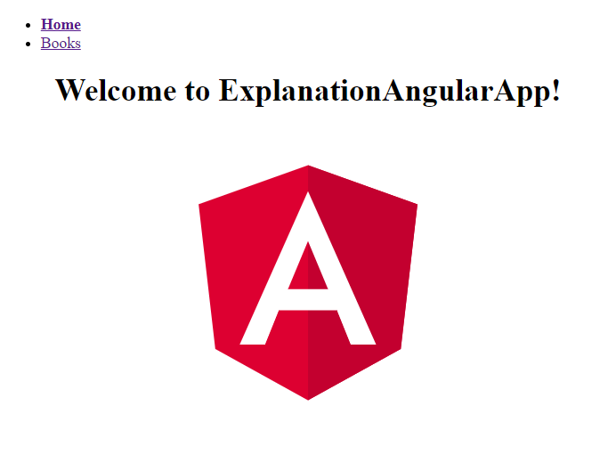
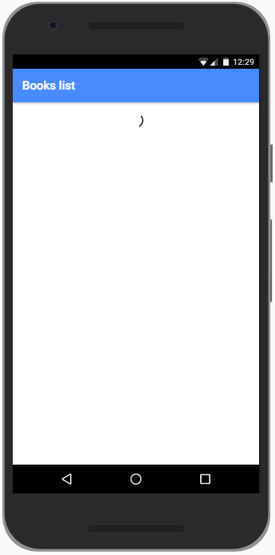
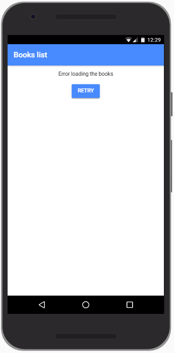
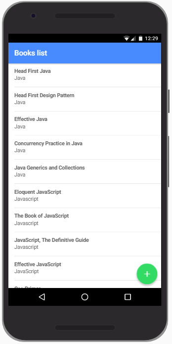
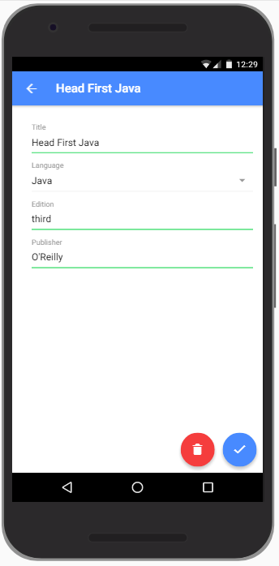
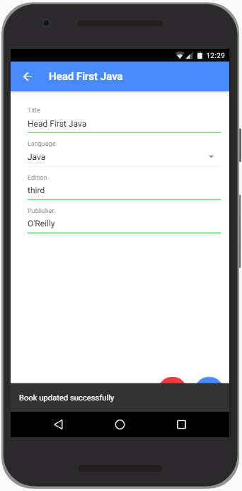
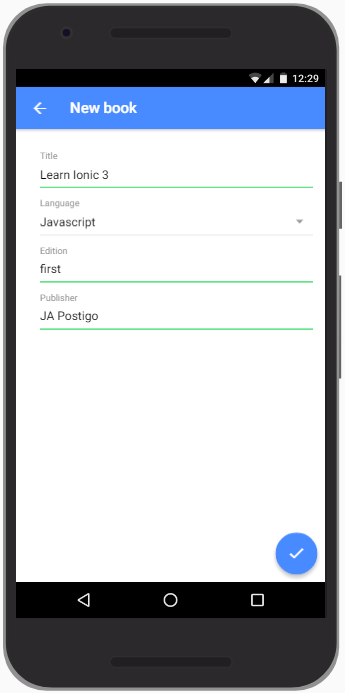
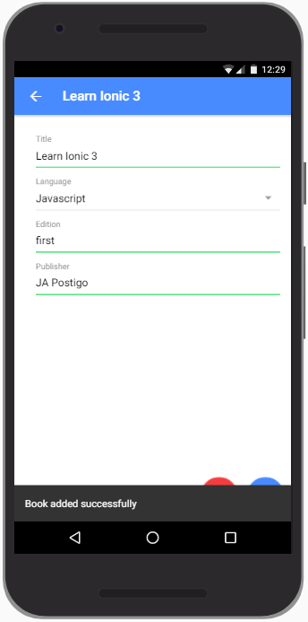
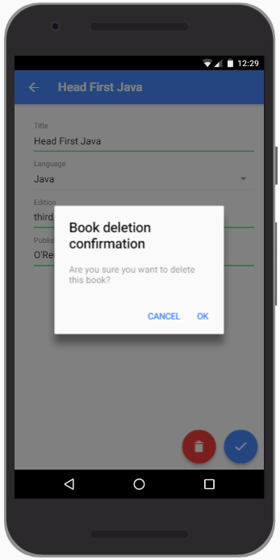
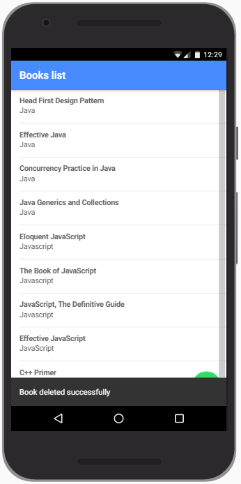

# Día 7

## Conceptos

- Proyecto de Angular puro (sin Ionic)
- Cordova (+ plugins)

## Ejemplo básico de Angular



- Instalar Angular:

```Shell
npm install -g @angular/cli
```

- Crear un proyecto base ejecutando el siguiente comando:

```Shell
ng new angular-explanation-app --minimal --routing --style=scss --prefix app --skip-git
```

(nuevo proyecto angular angular-explanation-app, minimalista: sin tests, con routing, con estilos SCSS, los componentes se prefijan con app- y sin git)

- Añadir al script `start` del package.json la opción `–open` y ejecutar:

```Shell
npm start
```

- Crear un componente que contendrá la página de inicio home:

```Shell
ng generate component pages/home.
```

y poner en él el título y la imagen de cabecera existentes

- En el archivo _src/app/app-routing.module.ts_, añadir la ruta de la página home, cuya lógica se cargará con la aplicación principal (sin lazy loading):

```Typescript
...
import { HomeComponent } from './pages/home/home.component';

const routes: Routes = [
  { path: 'home', component: HomeComponent }
];
```

- Observar que en app.component.html, las rutas se renderizan en:

```HTML
<router-outlet></router-outlet>
```

- Crear un componente que contendrá la página de lista de libros _books-list_:

```Shell
ng generate component pages/books-list
```

- Pero esta página será cargada con lazy loading, con lo cual requiere tener su propio módulo:

```Shell
ng generate module pages/books-list
```

- Hay que quitar de AppModule la declaración de BooksListComponent. Este componente debe estar declararlo en BooksListModule.
- También hay que incluir en BooksListModule el módulo RouterModule. Así, este archivo quedaría como sigue:

```Typescript
…
@NgModule({
  declarations: [
    BooksListComponent
  ],
  imports: [
    CommonModule,
    RouterModule.forChild([
      {
        path: '',
        component: BooksListComponent
      }
    ])
  ]
})
export class BooksListModule {}
```

- La ruta para esta página sería:

```Typescript
{ path: 'books', loadChildren: () => import('./pages/books-list/books-list.module').then(m => m.BooksListModule) }
```

- Sacar la plantilla de la vista incluida en _app.component.ts_ a su propio archivo _app.component.html_ (no es muy didáctico que lo presenten así en un proyecto de referencia…). También deberá tener su propio archivo de estilos app.component.scss.
- En _app.component.html_ crear un menú de enlaces a Home y Books en la parte superior.
- Preparar el enrutamiento para que el path vacío redirija (_redirectTo_) al path de _home_, el path _books_ redirija a la página de la lista de libros y que cualquier otro path (\*\*) redirija a una nueva página que informe que el recurso no se ha encontrado.
- Definir en el menú los enlaces a las rutas con la directiva _routerLink_.
- Añadir al enlace del menú cuya ruta es la activa la clase _is-current_ para así poner su texto en negrita.
- Crear en la página de libros una lista de 3 libros Book 1, Book 2 y Book 3 que redirijan a las rutas _books/1_, _books/2_ y _books/3_ respectivamente.
- Crear una página book-details y preparar el enrutador para que se redirija a la misma cuando la ruta sea _books/:id_.
- Preparar la pantalla del detalle del libro para que se muestre el id del libro que se pretende consultar (el que se pasa como parámetro en la URL).

## Ejemplo de aplicación de fotos para Android

- Instalar Android Studio
- Instalar la versión apropiada del SDK de Android (depende de la versión de cordova que usemos)
- Comandos de cordova:

```Shell
ionic cordova platform add android
ionic cordova run android
ionic cordova plugin add cordova.plugin.camera
```

- Herramienta de depuración desde chrome://inspect/
- Uso del servidor de mocks desde la aplicación funcionando en un dispositivo a través de ngrok:

```Shell
npm i -g ngrok
ngrok http 3000
```

- Repaso a los plugins de codova más comunes y ejemplo de uso de algunos de ellos.

---

## Aplicación de gestión de libros en Ionic

Se pretende hacer una aplicación completa de gestión de libros. Ésta dispondría de funcionalidad para:

- Consultar la lista de libros disponibles
- Consultar el detalle de un libro
- Editar el detalle de un libro
- Añadir un nuevo libro
- Eliminar un libro existente
- El desarrollo de la aplicación se segmentará en un ejercicio por cada bloque funcional de los listados anteriormente.

## Ejercicio 1

Pantalla de listado de libros. Los libros se obtendrán del mocksServer. Mientras no estén disponibles, se mostrará un spinner de carga. Si ocurre un error al cargar, se ofrecerá la posibilidad de reintentar la carga.






## Ejercicio 2

Pantalla del detalle de un libro. Se ofrecerá un formulario, con el cual se podrá consultar los detalles del libro, pero también editarlo si se pulsa sobre el botón de actualizar. Mientras se esté produciendo una actualización, los botones estarían deshabilitados. Una vez que se actualice, se mostrará un toast para informar al usuario sobre el resultado de la operación, haya ido bien o mal.




## Ejercicio 3

Pantalla de añadir nuevo libro. Es exactamente igual que la de edición de libro, sólo que, en lugar de editar un libro existente, añadirá uno nuevo. Una vez que el libro haya sido añadido, se mostraría el formulario de edición. También se debe mostrar un toast para informar al usuario sobre el resultado de la operación.




## Ejercicio 4

Funcionalidad de eliminar un libro. En la pantalla de detalle de un libro se dispondrá de un botón de eliminar, que al pulsarse pedirá confirmación para eliminar el libro en cuestión. Si la operación ha sido exitosa, se redirigirá al usuario a la página del listado. En caso contrario no. En ambos casos, se debe de informar al usuario del resultado de la operación con un toast.


