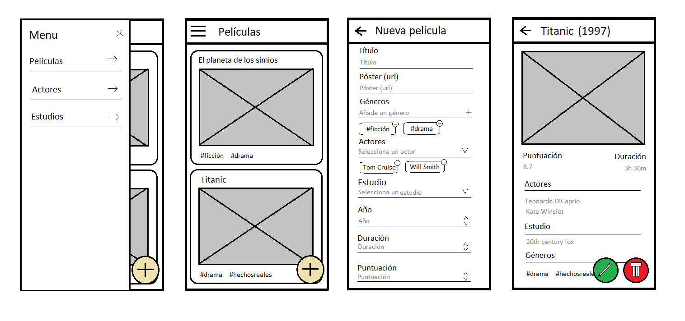

# Exámen

La prueba consiste en desarrollar una pequeña aplicación web, para **consultar y tratar nuestra base de datos de películas**. Te ha tocado desarrollar la feature **“movies”**, que es la principal de las
3 existentes actualmente: Movies, Actors, Companies.
El equipo de negocio nos ha pasado el siguiente wireframe y nos indican que tenemos total libertad para crear el diseño.
En cualquier caso la aplicación debe constar de: **Menu de navegación lateral, listado de películas, detalle de una película con posibilidad de edición y borrado y la creación de una nueva película**.



## Antes de empezar

- Usando el repositorio Git de los ejercicios, crea una carpeta exámen. Se tendrá mucho en cuenta la metodología de trabajo (commits, branches, issues, pull request, ...). Parte de nuestra evaluación se basa en cómo afrontas los problemas y la única forma que tenemos de verlo es mediante commits.

- Con este documento, se te entrega un fichero “db.json” para que levantes un servicio rest local usando la librería “json-server”. Es obligatorio que añadas un delay a este servicio:

  ```bash
  json-server --watch db.json --delay 1000
  ```

## Puntos obligatorios

- Puedes crear la arquitectura como la consideres más oportuna. No importa la sobre-ingeniería inicial, ya que se entiende que el proyecto escalará en un futuro cercano.

- Usar las mejores prácticas que conozcas de desarrollo y de rendimiento.

- Tienes total libertad para utilizar cualquier componente, servicio, etc que proporcione Ionic o cualquier otra librería que gustes incorporar.

- Usar la internacionalización con ngx-translate. Sólo es necesario que incluyas el español.

- Hay que tratar **los estados loading** (loader, spinner, progressbar, ...) **y de error** en las llamadas backend.